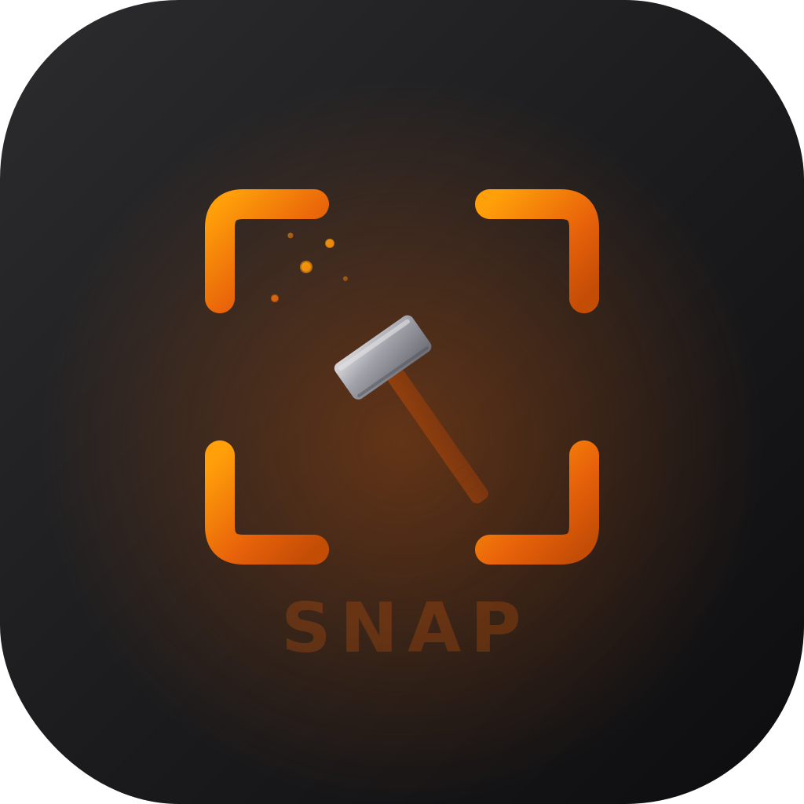

<p align="center">
  
</p>

<h1 align="center">SnapForge</h1>

<p align="center">
  <strong>A privacy-first macOS screenshot & screen capture tool with on-device AI.</strong><br/>
  Built to replace CleanShot X — without the subscription, without the cloud, without the compromise.
</p>

<p align="center">
  
  
  
  
  
</p>

---

## Why SnapForge?

Most screenshot tools either lack power or demand your data. SnapForge is different:

| | CleanShot X | macOS built-in | **SnapForge** |
|---|---|---|---|
| Region / fullscreen capture | Yes | Yes | **Yes** |
| Scrolling capture | Yes | No | **Yes** |
| Screen recording (H.265/ProRes) | Yes | Partial | **Yes** |
| GIF recording | Yes | No | **Yes** |
| OCR text extraction | No | No | **Yes** |
| AI-powered analysis | No | No | **Yes (on-device)** |
| Annotation editor | Yes | Markup only | **Yes** |
| Searchable library | Yes | No | **Yes (FTS5)** |
| Automation API | No | No | **Yes (REST + Shortcuts)** |
| Runs entirely on-device | No | Yes | **Yes** |
| Subscription required | $8/mo | Free | **Free & open source** |
| Sends data to the cloud | Yes | No | **Never (by default)** |

### The philosophy is simple

> **Your screenshots are yours.** Every pixel stays on your Mac unless *you* decide otherwise.

SnapForge runs AI models locally via Core ML and MLX — no API keys required, no data leaves your machine. Cloud providers (OpenAI, Anthropic) are available as opt-in if you want them, but the app is fully functional offline.

---

## Features

### Capture Everything

- **Screenshot** — Full screen or selected region (PNG, JPEG, TIFF)
- **Scrolling Capture** — Automatically scrolls and stitches long pages
- **Screen Recording** — H.265 (default), H.264, or ProRes with adaptive quality
- **GIF Recording** — Quick animated captures for docs, bug reports, demos
- **OCR Capture** — Extract text from anything on screen using Apple Vision
- **Pin** — Float any capture above all windows for reference

### Smart Post-Capture

After every capture, a floating **Action Bar** appears with one-click actions:

`Annotate` · `Copy` · `Save` · `Share` · `Wallpaper` · `Pin` · `Delete`

The bar **remembers your last choice** per capture type — your workflow stays fast.

### Library with Full-Text Search

Every capture is stored with rich metadata — source app, window title, dimensions, tags, stars, and OCR text. The library uses **SQLite FTS5** for blazing-fast full-text search across everything, including text inside your screenshots.

### On-Device AI

| Provider | Runs On | Setup |
|----------|---------|-------|
| **Core ML** | Your Mac (CPU/ANE) | Built-in, zero setup |
| **MLX** | Your Mac (GPU) | Download MLX models |
| **Ollama** | Local server | Install Ollama |
| **OpenAI** | Cloud (opt-in) | API key |
| **Anthropic** | Cloud (opt-in) | API key |

**What the AI can do:**
- Explain and analyze captured images
- Suggest smart annotations
- Detect UI elements and text regions
- Custom prompt templates for repeatable workflows

### Automation

SnapForge exposes a **localhost REST API** for scripting:

```bash
# Take a screenshot from the terminal
TOKEN=$(security find-generic-password -s "com.snapforge.automation" -a "bearer-token" -w)
curl -X POST http://localhost:48721/api/v1/capture -H "Authorization: Bearer $TOKEN"
```

Plus **Siri Shortcuts** integration and a `snapforge://` URL scheme for deep linking.

### Command Palette

A keyboard-driven overlay for power users — fuzzy-search any action, trigger captures, search your library, or run AI commands without touching the mouse.

---

## Installation

### From Source (recommended)

Requires macOS 15.0+ and Swift 6.0+ (Xcode 16+ or [swiftly](https://github.com/swiftlang/swiftly)).

```bash
git clone https://github.com/salvadalba/nodaysidle-snapforge.git
cd nodaysidle-snapforge

# Build, package, and launch
bash Scripts/compile_and_run.sh

# Or just build the .app bundle
SIGNING_MODE=adhoc bash Scripts/package_app.sh release

# Install to Applications
cp -R SnapForge.app /Applications/
```

### First Launch

1. SnapForge appears as a **hammer icon** in the menu bar (it's a menu bar app — no Dock icon).
2. macOS will ask for **Screen Recording** permission — grant it in System Settings > Privacy & Security.
3. You may need to restart the app after granting permission.

---

## Architecture

SnapForge is built with modern Swift 6 and SwiftUI 6:

```
SnapForge/
├── App/              # App entry point, services container
├── Capture/          # ScreenCaptureKit integration, recording pipeline
├── AI/               # Pluggable provider system (CoreML, MLX, Ollama, Cloud)
├── Library/          # SwiftData models + SQLite FTS5 search
├── Sharing/          # AES-GCM encrypted uploads, Keychain storage
├── Automation/       # REST API bridge + AppIntents + URL scheme
├── UI/               # SwiftUI views, settings, action bar, command palette
└── DesignSystem/     # Forge-inspired color palette and typography
```

**Key architectural decisions:**

- **Actor isolation** throughout — `CaptureEngine`, `LibraryService`, `SharingService`, and `ModelManagerService` are all actors for safe concurrency
- **@Observable** pattern with `AppServices` as the dependency container
- **Protocol-based AI providers** — hot-swap between backends at runtime
- **Dual persistence** — SwiftData for structured data, raw SQLite FTS5 for search performance
- **NWListener** for the automation API — no web framework dependency
- **CryptoKit** AES-GCM for share link encryption, Keychain for secrets

---

## Keyboard Shortcuts

| Shortcut | Action |
|----------|--------|
| `Cmd+Shift+4` | Take Screenshot |
| `Cmd+L` | Open Library |
| `Cmd+,` | Open Settings |
| `Cmd+Q` | Quit SnapForge |
| `Arrow Keys` | Navigate Action Bar |
| `Return` | Confirm Action |

---

## Privacy & Security

- All AI runs **on-device** by default (Core ML / MLX)
- **Zero telemetry** — no analytics, no tracking, no phone-home
- Screen data **never leaves your Mac** unless you explicitly share
- Share links use **AES-GCM encryption** with optional password protection
- API tokens stored in **macOS Keychain**, never in plain text
- Adhoc code-signed; use a Developer ID certificate for distribution

---

## Documentation

- **[USERGUIDE.md](USERGUIDE.md)** — Complete user guide with all features, settings, and API reference
- **[PRD.md](PRD.md)** — Product requirements document
- **[ARD.md](ARD.md)** — Architecture decision records
- **[TRD.md](TRD.md)** — Technical requirements document
- **[DESIGN.md](DESIGN.md)** — Design system and visual language

---

## Tech Stack

| Component | Technology |
|-----------|-----------|
| Language | Swift 6.0 |
| UI Framework | SwiftUI 6 |
| Screen Capture | ScreenCaptureKit |
| Persistence | SwiftData + SQLite FTS5 |
| AI (on-device) | Core ML, MLX Swift |
| AI (cloud, opt-in) | OpenAI API, Anthropic API |
| OCR | Apple Vision |
| Recording | AVAssetWriter (H.264/H.265/ProRes) |
| Encryption | CryptoKit (AES-GCM) |
| Secrets | macOS Keychain |
| Networking | Network.framework (NWListener) |
| Automation | AppIntents, URL Scheme, REST API |
| Build System | Swift Package Manager |
| Target | macOS 15.0+ (Apple Silicon) |

---

## Building

```bash
# Quick build
swift build -c release

# Run tests
swift test

# Package as .app (adhoc signed)
SIGNING_MODE=adhoc bash Scripts/package_app.sh release

# Build + package + launch (dev loop)
bash Scripts/compile_and_run.sh

# Universal binary (Intel + Apple Silicon)
bash Scripts/compile_and_run.sh --release-universal
```

---

## Contributing

Contributions are welcome. SnapForge is built to be extended:

- **New AI providers** — implement the `AIProvider` protocol
- **New capture types** — extend `CaptureType` and add to the engine
- **Automation endpoints** — add routes to `AutomationBridge`
- **UI themes** — the design system is centralized in `DesignSystem/`

---

## License

MIT License. See [LICENSE](LICENSE) for details.

---

<p align="center">
  <sub>SnapForge — forging better screenshots, one capture at a time.</sub>
</p>
